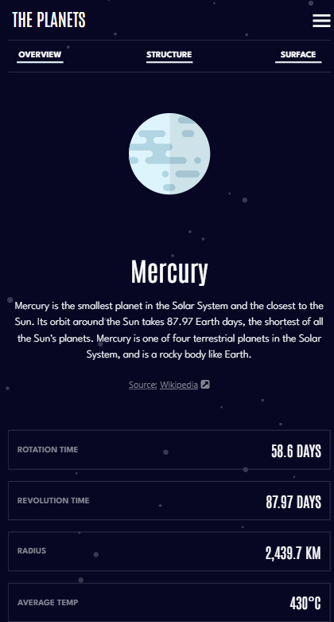

# Frontend Mentor - Planets fact site solution

This is a solution to the [Planets fact site challenge on Frontend Mentor](https://www.frontendmentor.io/challenges/planets-fact-site-gazqN8w_f). Frontend Mentor challenges help you improve your coding skills by building realistic projects.

### The challenge

Users should be able to:

- View the optimal layout for the app depending on their device's screen size
- See hover states for all interactive elements on the page
- View each planet page and toggle between "Overview", "Internal Structure", and "Surface Geology"

### Screenshot

### Links
- Live Site URL: [Live site](https://planets-fact-nine.vercel.app/)
## My process

### Built with
- Flexbox
- Mobile-first workflow
- [React](https://reactjs.org/) - JS library
- [Vercel](https://vercel.com/) - Deployment
- [Tailwind CSS](https://tailwindcss.com/) - For styles

## Author

- Frontend Mentor - [@JaacielBriseo](https://www.frontendmentor.io/profile/JaacielBriseo)
